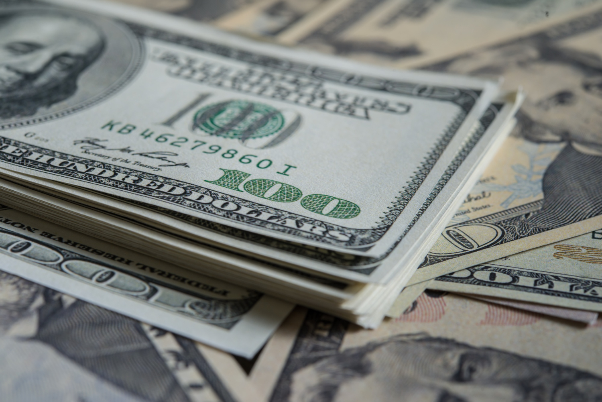

So, you want to be a billionaire. Well, who doesn't? But, how many life times do you have to achieve it?

Recently, many populist figures questions of how people becoming billionaires. Implicit is that they do not deserve what they have received or they got it through exploiting others. To counter this narrative, consider the current size of the American population. As of 2024 ACS 5-Year estimates published by the US Census Bureau, 334,922,499 people or roughly 335 million people live in America in 2024. So, selling one product to each person in America that earns \$3 profit once this year would earn one billion dollars. \$3 dollars does not sound like much, but 335 million of anything is. So, making and selling 335 million products that can earn \$3 profit will earn you \$1 billion, how long would it take to make and sell 335 million products?

For Alexandria Ocasio-Cortez, her 14th district in New York contains 776,970 residences, the effective market for her product - aka her political agenda. It would take her 431 congressional terms or 861 years to represent 335 million constituents. For Bernard Sanders, Vermont contains only 643,077 constituents. It would take him 521 senate terms or 3,126 years in the Senate to represent 335 million constituents. Little wonder why the two of them have been anxiously seeking to represent the entire American people, they don’t want to wait a few centuries to reach the 335 million baseline.

If you were an elementary school teacher (Bonus points, if you can remember each of yours. I would list all of mine here, but after a year with me in their classroom, I think they deserve not to relive that trauma of that year), it would take 13.4 million school years of teaching 25 students each year to teach 335 million students. If you became the principal of the elementary school, it would take roughly 558 thousand school years if her school taught roughly 600 students. If you became the superintendent for the school district, it would take roughly 13,400 years if the school district taught 25,000 students each year. If you became the chairman of the state board of education, it might take 67 years if the state has 5 million students. If you became Secretary of the US Department of Education, it would take 6 to 7 years to reach the 335 million baseline given the roughly 50 million students in the United States. That assumes that you receive only \$3 dollars for each student taught.

But elementary school teachers' salaries vary across the country. Teachers in Los Angeles and Chicago might make \$100,000 each year while teachers in Booneville, Mississippi earn about \$55,000. So let's say the typical elementary school teacher teaches 25 students each school and earns \$75,000 - \$3,000 per student. In a career, she - I know not all elementary school teachers are women, but most are - could teach for forty years if she teaches into her early sixties and teach up to 1,000 students. Assuming her earnings keep pace with and does not exceed inflation and other changes to the value of money over the forty year career, she would have \$3 million during a career. Not bad, but she would need to repeat her career 333 times to earn \$1 billion. To make \$1 billion, she would need to earn \$2.5 million each year or \$100,000 per student with a classroom of 25 students or 833 students at \$3,000 per pupil - imagine a first or second grade class with more than 800 pupils sitting in auditorium large enough to accommodate it. Any elementary school teacher capable of teaching a classroom with 800 students each year for forty years should be paid \$2.5 million each year.

Note: 25 students per class is chosen for convenience, but is based on the observations of my children’s elementary school in a suburb of Dallas-Fort Worth. 600 students is the product of the number of students per class, the number of classes in each grade at the same elementary school (4), and the number of grades in a typical K-5 elementary school (6). 25,000 students is roughly the number of students enrolled in my local school district. 5 million students is roughly the number of students enrolled in public schools Texas.

I suppose the first question that must be addressed is what does it mean to be a billionaire. Even the wealthiest individuals - Jeff Bezos, Bill Gates, and Elon Musk, don't have a billion dollars in cash. At least, I don't think they do. I would ask one of them, but I don't have their phone number. Even if I did, I doubt they would answer my call. I can say with some confidence that most of their financial assets are tied to the companies they own and other investments.

With that disclaimer out of the way, the key to becoming a billionaire is scale and time. The smaller the scale the greater profit that must be earned. Access to one thousand customers, requires each customer to spend one million dollars. So, how many millionaires do you know? Do you have anything worth buying for a million dollars?

Before anyone mentions the benefits of compounding interest, it would take more than 170 years for \$10,000 - the amount used to highlight the performance of mutual funds to compound to \$1 billion. The same investment of \$1 million would take at least 103 years to compound to \$1 billion.